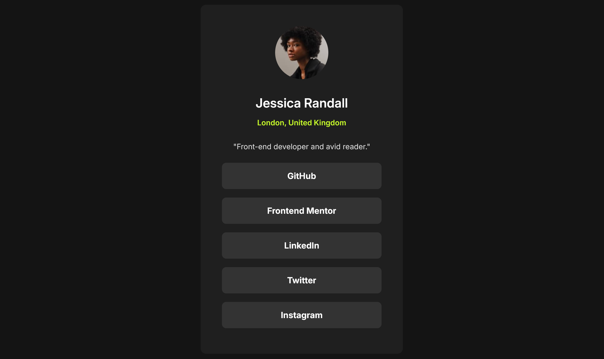

# Frontend Mentor - Social links profile solution

This is a solution to the [Social links profile challenge on Frontend Mentor](https://www.frontendmentor.io/challenges/social-links-profile-UG32l9m6dQ). Frontend Mentor challenges help you improve your coding skills by building realistic projects. 


## Table of contents

- [Overview](#overview)
  - [Screenshot](#screenshot)
  - [Links](#links)
  - [Built with](#built-with)
  - [What I learned](#what-i-learned)

## Overview

Nice projet to get an overview of what Frontend Mentor has to offer.

### Screenshot



### Links

- Live Site URL: https://telemoca.github.io/social-links-profile/

### Built with

- Semantic HTML5 markup
- CSS custom properties
- CSS hovering and transitions
- Flexbox

### What I learned

I learned to use variables and to center stuff using `position: absolute;` like this :

```css
.attribution {
   position: absolute;
   bottom: 5px;
   left: 50%;
   transform: translateX(-50%);
}
```